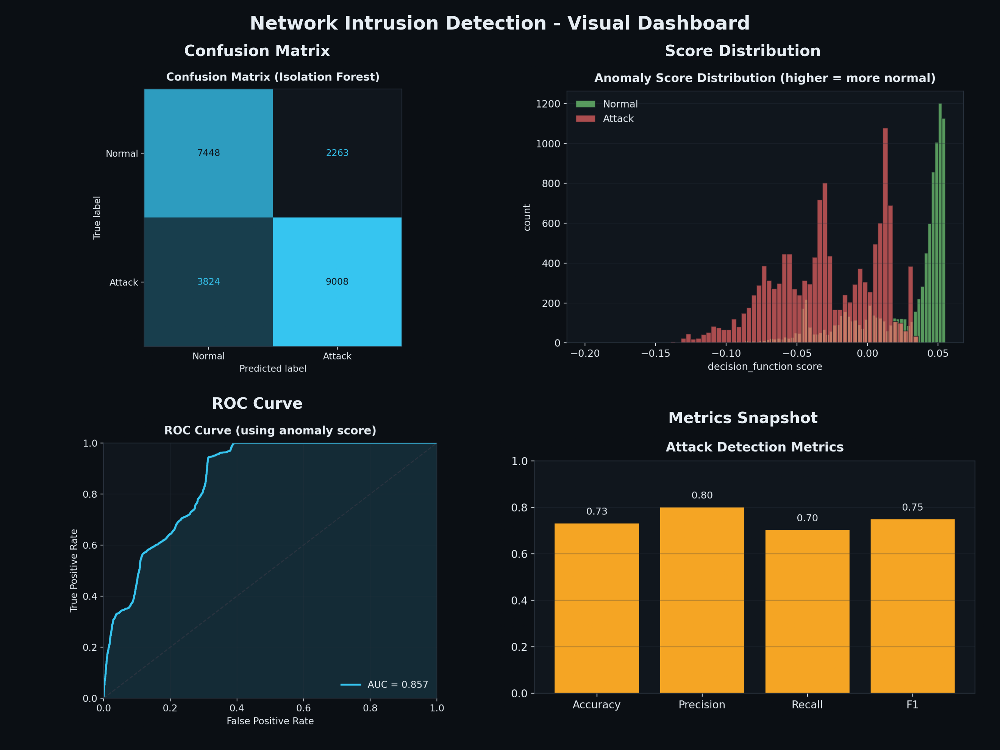
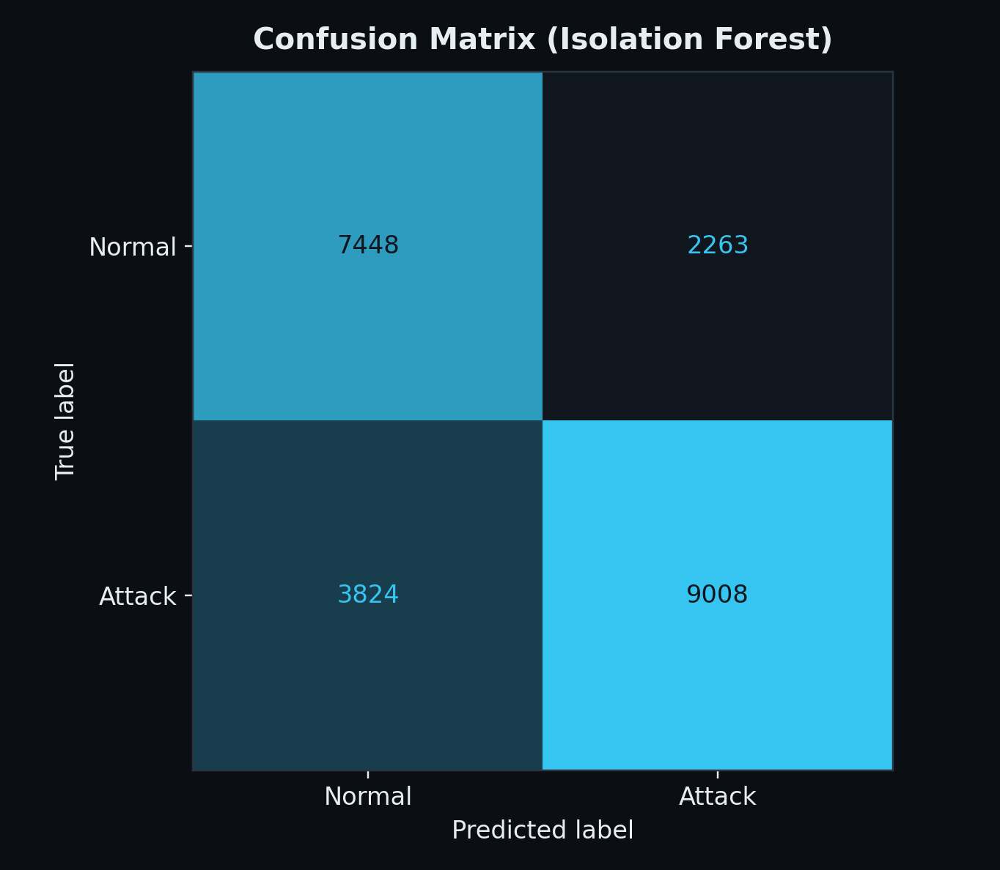
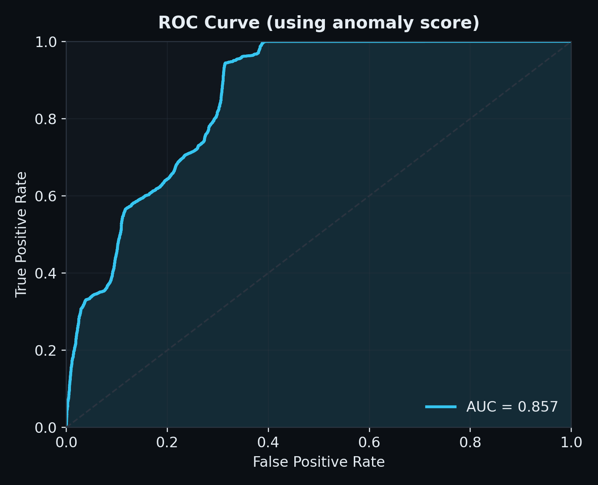
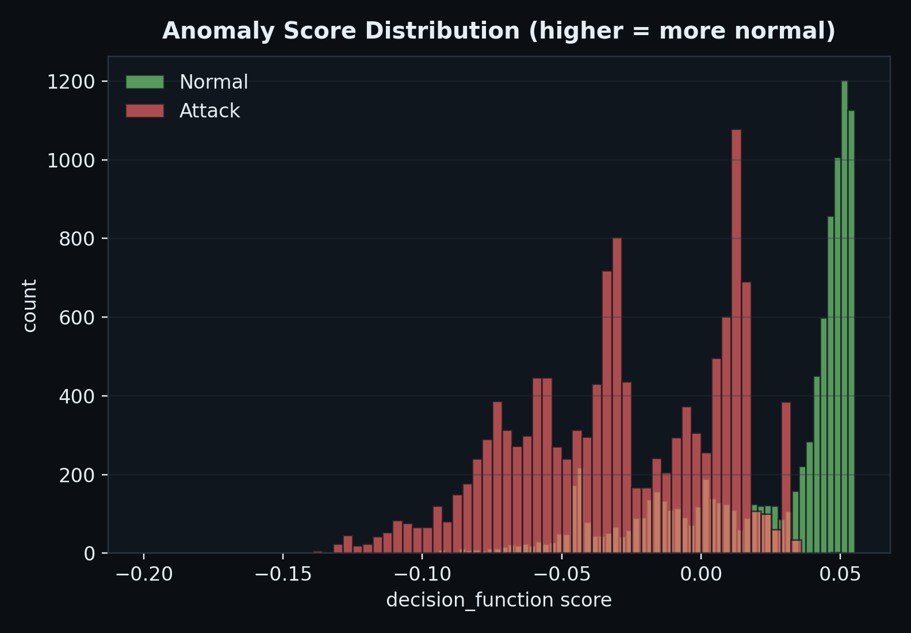
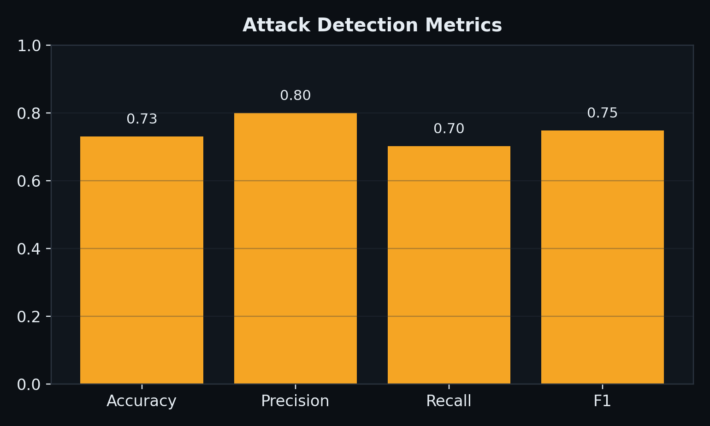

# Network Intrusion Detection with Isolation Forest

This project is a simple, end-to-end demo of **network intrusion detection** using an **Isolation Forest** model. It includes a Python pipeline that trains and scores data, generates clear visual reports, and a clean front-end dashboard that lets you upload a CSV and view results.

The goal is to make anomaly detection understandable for beginners while still producing professional, publish-ready outputs.

**What problem this solves**
Network traffic often contains rare, suspicious patterns (intrusions). These rare patterns are called **anomalies**. The system learns what “normal” looks like and flags anything unusual.

**High-level flow (start to finish)**

1. You upload a CSV of network data.
2. The backend runs a pipeline that cleans and encodes the data.
3. Isolation Forest assigns an anomaly score to every row.
4. If labels exist, the system evaluates accuracy and builds a confusion matrix and ROC curve.
5. Visual plots are generated and shown in the front-end dashboard.

---

**How the Isolation Forest works (simple explanation)**
Isolation Forest is built from many random decision trees. Each tree keeps splitting the data using random features and random cut points. **Unusual points are isolated faster** (with fewer splits). Those short paths are used to give a higher anomaly score.

---

**Project architecture**
This repository has three parts working together:

1. **Front-end (static UI)**

- Files: `index.html`, `styles.css`, `app.js`, `assets/`
- A clean dashboard that shows summary metrics and plots.
- Handles CSV uploads and displays results.

2. **Backend server (local API)**

- File: `server.py`
- Serves the UI and exposes an API endpoint at `/api/run`.
- Accepts a CSV upload and triggers the Python pipeline.

3. **Machine learning pipeline**

- Files: `source/run_pipeline.py` and helper scripts in `source/`
- Cleans and encodes data, runs Isolation Forest, and generates plots.

---

**Data format (what your CSV should look like)**

- **Rows** are individual network records (flows or connections).
- **Columns** are features like bytes, protocol, flags, etc.
- A **label column is optional**. If present, it should contain values like `normal` or attack types.

The pipeline automatically tries to find a label column using names like:

- `label`, `class`, `target`, `attack`, `outcome`, `y`

If a label column is found:

- You get Accuracy, Precision, Recall, F1, Confusion Matrix, and ROC Curve.

If no label column is found:

- You still get anomaly scores and distribution plots.

---

**How to run the project**

1. **Install Python dependencies**

```bash
python -m pip install -r requirements.txt/requirements.txt
```

2. **Start the local server**

```bash
python server.py
```

This will serve the UI and API on `http://localhost:8000` (or the next free port).

3. **Open the UI**

- Visit the local URL printed by the server.
- Upload a CSV file or click “Load Sample”.
- Results will update automatically.

---

**Run the pipeline directly (optional)**
If you want to bypass the UI:

```bash
python source/run_pipeline.py --input data/NSL-KDD.csv
```

This will generate outputs in `data/` and `results/plots/`.

---

**What the pipeline outputs**

- `data/X_processed.csv` → Encoded and scaled features
- `data/predictions.csv` → Model prediction per row (`1` normal, `-1` anomaly)
- `data/scores.csv` → Anomaly scores (higher = more normal)
- `data/y.csv` → Labels (only if a label column was present)
- `results/summary.json` → Small summary used by the UI
- `results/plots/` → Confusion matrix, ROC curve, score distribution, metrics snapshot, dashboard collage

---

**Screenshots (generated after running the pipeline)**
Dashboard overview:


Confusion matrix:


ROC curve:


Score distribution:


Metrics snapshot:


---

**Results (current run)**
The following numbers are from the most recent pipeline run in `results/summary.json`.

- Rows processed: 22,543
- Columns: 42
- Missing values: 0
- Numeric features: 38
- Predicted normal: 11,272
- Predicted anomalies: 11,271
- Accuracy: 0.73
- Precision: 0.80
- Recall: 0.70
- F1 score: 0.75

---

**Key configuration options**

- **API base URL (deployment):** set in `config.js` as `window.API_BASE_URL`.
- **Contamination (expected anomaly rate):** set in `source/run_pipeline.py` as `contamination=0.5`.
  - This is the assumed fraction of anomalies in your data.
  - If your dataset has fewer anomalies, reduce this number. .....

---

**Helper scripts (optional)**
These scripts are useful for step-by-step experimentation:

- `source/preprocess.py` → Preprocess and save encoded features
- `source/train_model.py` → Train Isolation Forest and save predictions
- `source/evaluate.py` → Print confusion matrix and classification report
- `source/visualize.py` → Generate all plots from saved outputs

---

**Glossary (simple definitions)**

- **Anomaly:** A rare or unusual data point that looks different from normal traffic.
- **Intrusion:** A malicious or suspicious activity in network traffic.
- **Isolation Forest:** An anomaly detection model that isolates unusual points quickly using random splits.
- **Isolation Tree:** A single decision tree inside the forest.
- **Contamination:** The model’s assumption about how many rows are anomalies (for example, 0.05 = 5%).
- **Feature:** A column in your dataset (example: bytes sent, protocol type).
- **Label:** The correct answer for a row (example: `normal` or `attack`).
- **One-hot encoding:** Converting text categories into numeric columns (example: protocol = tcp/udp).
- **Standardization:** Scaling numbers so they have similar ranges and the model learns fairly.
- **Anomaly score:** A numeric value from the model; lower often means more suspicious.
- **Prediction:** The final model output per row (`1` = normal, `-1` = anomaly).
- **Confusion Matrix:** A table that shows correct vs incorrect predictions when labels exist.
- **ROC Curve:** A graph that shows the tradeoff between catching attacks and false alarms.
- **AUC:** “Area Under the Curve”, a single number that summarizes the ROC curve (higher is better).
- **Precision:** Of all predicted attacks, how many were truly attacks.
- **Recall:** Of all true attacks, how many were correctly found.
- **F1 Score:** A balance between precision and recall.
- **Accuracy:** Overall fraction of correct predictions.

---

**Notes and limitations**

- Isolation Forest is **unsupervised**, so it does not “learn” attack types directly.
- If labels are missing or incomplete, evaluation metrics are limited.
- The default contamination value may not match your real-world data distribution.

---

**Summary**
This project gives you a full pipeline for intrusion detection: upload data, score anomalies, visualize results, and understand the model outputs in clear terms. It is designed for both learning and presentation, with a clean UI and professional visuals.
